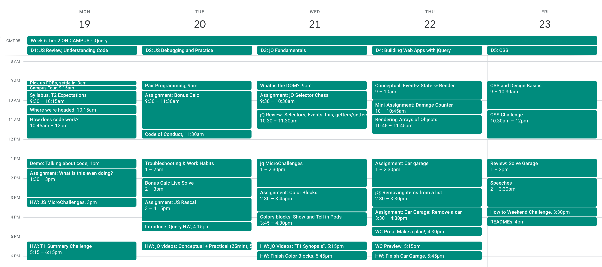

# Week 6 Overview

## Week Objectives

- Introduce students to the Prime space, and get them comfortable working with each other
- Visualize the execution of JS code, in terms of variables, expressions, control flow
- Practice talking about code with others
- Introduce working habits for writing and troubleshooting code
- Learn to use to jQuery manipulate the DOM
- Establish coding patterns for rendering state to the DOM, which will be used throughout the program.
- Build comfort using HTML/CSS to design clean, functional, and accessible web apps

# Sample Calendar

[📅 On Google Calendar](https://calendar.google.com/calendar/u/1/r/week/2021/3/1?cid=Y183Z2hiczZrN3A4bzIzOGJvbWdtaW1jcmZkOEBncm91cC5jYWxlbmRhci5nb29nbGUuY29t) (on the _Dahl_ cohort calendar, 03/01/2021)

## Assignments

### After _How does code even work?_

- [What Is This Even Doing?](https://github.com/PrimeAcademy/what-is-this-even-doing)
  - Practices reading, understanding, and talking about code.
  - group whiteboard (no computer coding) project to reinforce JS basics, includes a presentation (speak) practice   
  - v4.2.3 reduced and refocussed challenges around types and functions 
- [JS Micro Challenges](https://github.com/PrimeAcademy/javascript-micro-challenges)
  - Series of very small targeted JS foundational tasks
  - Homework for day 1
  - v4.2.3 moved to primary (not optional) assignment
- [Tier 1 Summary Challenge](https://github.com/PrimeAcademy/tier-1-code-challenge)
  - The purpose of this challenge is to help students generate targeted/specific questions for JS review this week
  - Cumulative assessment of Tier 1 content
  - Students will spend 2 hours with the challenge, then submit code as usual
  - Students will also need to work through this challenge on their own

### After _Pair Programming_
- [Bonus Calculator Pair Programming Project](https://github.com/PrimeAcademy/object-group-bonus-calculator)
  - First pair programming project, see notes on activity or [notes](./06-02a_pair-programming.md)
  - Largest JS assignment students have completed to date. Requires complex logical thinking, and practices all concepts from Tier 1.
  - Processing an array of data with business rules and logging the results. No DOM in base mode.
  - updated for v5.1.1

### After _Troubleshooting & Work Habits_

- [JaRa JavaScript Rascal](https://github.com/PrimeAcademy/jara-javascript-rascal)
  - Bug-hunt activity to practice debugging basic JS errors
  - v4.3 removed all class syntax

### After _jQuery Preview_

- [jQuery Fundamentals (Video Lectures)](https://github.com/PrimeAcademy/jquery-fundamentals-video)
  - Students will watch videos as homework, and review in class the next day
  - _jQuery Preview_ lecture covers some missing items from the video (the DOM, downloading jQuery, etc)
  - In the video, we create:
    - A button that logs a value from an `<input>`
    - A list of `<h1>` elements that change color on hover
  - Covers:
    - Role of HTML/CSS/JS in web apps
    - Selectors
    - Event handlers
    - Getters/Setters with `.val()`, `.text()`, `.css()`
    - `$(this)`

### After _What is the DOM_

- [jQuery Selector Chess](https://github.com/PrimeAcademy/jquery-selector-chess)
  - Repetition with short practice functions using jQuery selectors
  - Intended as a bit of "hands on" practice after the jQuery video homework, and before diving deeper into jQuery.

### After _jQuery Review: Selectors, Events, and the DOM_

- [Color Blocks](https://github.com/PrimeAcademy/color-blocks)
  - Practices:
    - events handlers, with event delegation
    - appending to the DOM
    - keeping state in a global variable
    - $(this)
  - End the day with sharing and reflections in pods. 
  - Students must complete color blocks as homework, if not completed in class.

### Before _The Pattern_

- [jQuery Patterns (Video Lectures)](https://github.com/PrimeAcademy/jquery-patterns-video)
  - As homework for W6D3, review in class the next day
  - Shows Event/State/DOM patterns, though without using that specific language
    - Form submission adds an object to an array (Event -> State)
    - Array of objects is rendered to the DOM, using loops and append (State -> Render)

### After _Event -> State -> Render_

- [jQuery Fungus Fighter](https://github.com/PrimeAcademy/jquery-fungus-fighter)
  - Practices Event -> State -> Render, without using lists

### After _Rendering Arrays of Objects_

- [Car Garage](https://github.com/PrimeAcademy/prime-pw-week-6-assignment)
  - Form submission adds an object to an array (Event -> State)
  - Array of objects is rendered to the DOM, using loops and append (State -> Render)

### After _Removing Items from a List_

- [Car Garage: Part 2](https://github.com/PrimeAcademy/prime-pw-week-6-assignment)
  - Follow up on Part 1, includes removing item from the list view
  - Use `splice()` or loop to remove item from state

### After _CSS and Design for Full Stack Engineers_

- [Order Summary CSS Challenge](https://github.com/PrimeAcademy/order-summary-css-challenge)
  - Asks to replicate a design from an image
  - Requires centering, spacing, buttons, text, etc
  - Does _not_ require much layout (eg. flexbox)

### Before assigning Weekend Challenge

- [Weekend Challenge Guidebook](../../cohort-syllabus/weekend-guidebook.md)
  - Have a plan for the weekend!

- [README.md Template](https://github.com/PrimeAcademy/github-finalization-assignment/#readmes)
  - Encourage students to document their project, using this template as a guide.

---

## Challenge Assignments

- Weekend Challenge [Monthly Salary Calculator](https://github.com/PrimeAcademy/weekend-jquery-salary-calculator)
- Code Challenge [Color Blocks Swap](https://github.com/PrimeAcademy/code-challenge-1)
    - updated for v4.2.5 remove color swap requirement

---

## Grading Rubrics

- T1 Summary Challenge Rubric [Scrabble Game](../../rubrics/challenge-6-js-basics.md)
- Weekend Challenge Rubric [Monthly Salary Calculator](../../rubrics/weekend-7-bonus-calc.md)
    - updated for v4.2.2 -- changed filename
- Code Challenge Rubric [jQuery, DOM, Boxes](../../rubrics/challenge-7-jquery.md)
    - updated for v4.2.5 remove color swap requirement
