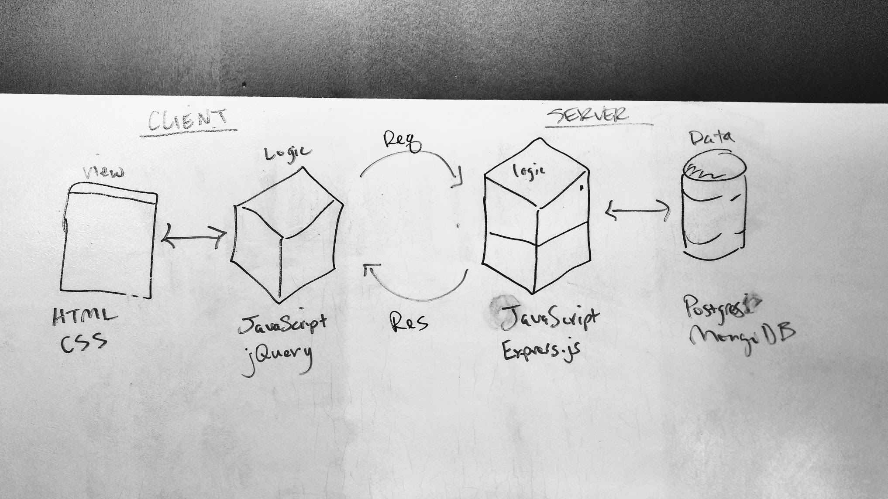
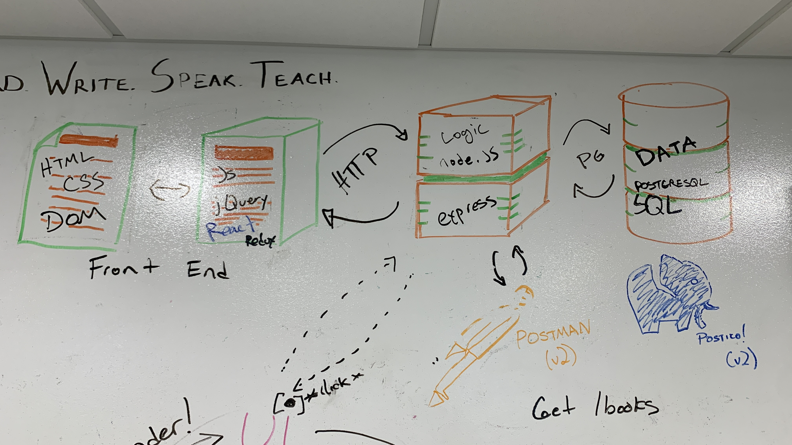
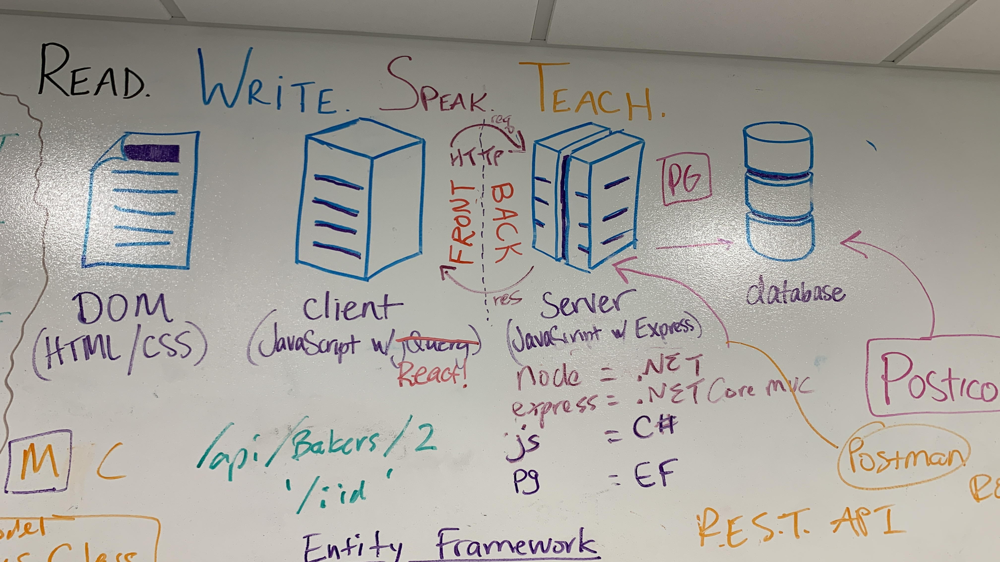

# The Conceptual Stack

Over the course of T2/T3 you will use a visual map to show where in the stack our technologies (languages, runtimes, libraries, tools) exist in relation to one another.

This is the “conceptual model” drawing and a critical tool. It is a very grounding thing to have on the top of your whiteboard and always visible. You can refer to it often and extend it.

The visual also serves as a "look how far you've come" reminder.

The sooner you can ground where technologies (and what happens) go on a visual map, the more you can use that for reinforcement.

## Weekly Additions

You're going to be adding to this visual map every week.

Make a show of it, USE this map to your advantage to ground concepts and technologies and where they go.

## Example Conceptual Fullstack Drawings

### Week 9/Plain

### Week 11

### Week 16

---

## Week 7: Client Side

The first step is breaking about the Client Side on the left.

1. Draw in the Browser/View box which represents what is visual to the user
    - HTML
    - CSS
2. Draw in the Logic box which represents client side (browser) JavaScript code
    - JavaScript
    - jQuery

Label over the top of both of these: Client (or Clientside)

## Week 8: Server Side and Ajax/HTTP Requests

This week, bring in our brand new Server its components along with the flow of HTTP requests.

1. Draw in the Server box and label it. Leave space to illustrate the Request-Response cycle.
    - Node
    - JavaScript
    - Express
    - REST API
2. Draw the Request-Response flow for our HTTP Requests.
    - One arrow on the top goes from the Logic clientside box to the Server box and is labeled "Request" or "Req" (as in express' `req` object)
    - On the bottom side, draw another arrow back the opposite way. Label it "Response" or "Res" (again, matching express' `res.send()`)
    - Ajax or HTTP. Students gravitate better to "ajax" as the jQuery method is called `.ajax()`. This does very much confuse the term as a general process.
3. Add in Postman and draw an arrow from it to the Server and back. This box signifies that we can use other "clients" apart from our browser to make requests to the server.

Label over this: "Server" or "Serverside"

## Week 9: Database

This week we will add the final "big" box all the way on the righthand side: The Database.

1. Draw in the Database on the far left.
    - PostgreSQL
    - SQL
2. Draw an arrow/arrows representing the query flow from Server to Database.
3. In this arrow space, label the library:
    - pg
4. Add in Postico and draw an arrow from it to Database and back. This box signifies that we can use other "clients" apart from our browser to make requests to the Database. 

Together, the Server and Database should be labeled "Server" or "Serverside"

## Week 10: React

1. Add another label under the Clientside Logic box
    - React

## Week 11: Redux

1. Add another label under the Clientside Logic box
    - Redux

## Week 11: Redux-Saga

1. Add another label under the Clientside Logic box
    - Redux-Saga

## Week 12: 3rd Party APIs

This week you can add smaller circles or boxes to illustate that other REST APIs exist, and we can make requests to them. The API lecture makes requests from the Server, so drawing arrows to that is accurate tho we can do the same from the Client as well.

## Week 16: C#/.NET technologies

In this week we are wholesale replacing Node/JS/Express/pg on the Serverside with other technolgies. 

This replacement needs to be emphasized and used to draw parrallels as to the kinds of things our new Dotnet code is doing.

1. Under the Server box
    - C#
    - .NET Core MVC
    - Entity Framework
