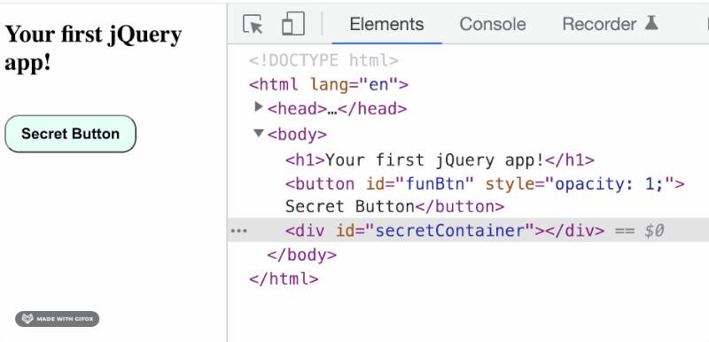
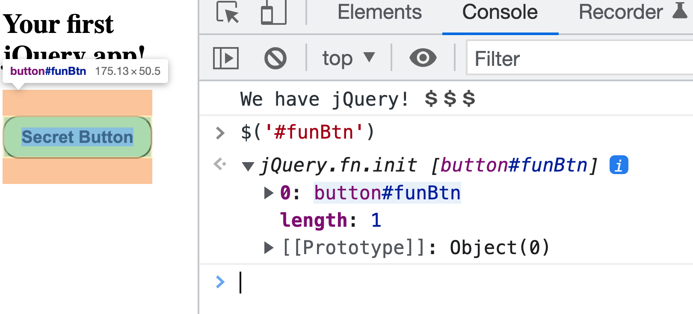

# jQuery and The DOM

> Note: This lecture reviews content introduces in the [jQuery Fundamentals Assignment](https://github.com/PrimeAcademy/jquery-fundamentals-video), and accompanying video lectures.

## Assignment Review

From the [jQuery Fundamentals Assignment](https://github.com/PrimeAcademy/jquery-fundamentals-video), review:

- What is jQuery?
- Downloading and sourcing jQuery (live code in class)
- What is the DOM?

## The DOM Demystified

The DOM is the current state of HTML elements, in the user's browser. **The DOM is not your index.html file:** The index.html file is the starting point. Everything in that file is loaded into the browser and becomes the DOM! 

jQuery can create, modify, and remove HTML elements from the DOM, but it cannot change your `index.html` file!

Look in the _Elements_ panel, what happens when we click the button:



The _Elements_ panel shows the current state of the DOM, so very useful for debugging jQuery web apps.

### A Tree Structure


- The DOM is organized as a tree structure
- Elements may be "nested" within other elements
- Elements may have attributes, text content, and children
- Language: "parents" and "children"

## Selectors: How we access the DOM

jQuery can **save elements as javascript variables**:

```js
let funButton = $('#funBtn');
console.log(funButton);
```



You can see that this element variable looks a lot like an array. That's because jQuery can select multiple elements at once:

```js
let allListItems = $('li');

// And we can operate on multiple elements at once!
allListItems.remove();
```

When we call the jQuery function `$()`, we pass a string as an argument. This string is called a **selector**. 

You may notice that **jQuery uses the same syntax for selectors as CSS:**

Selector | Example | Description
--- | --- | ---
element | div | Selects all elements with that tag
[.class](https://www.w3schools.com/cssref/sel_class.asp) | .intro | Selects all elements with class="intro"
[#id](https://www.w3schools.com/cssref/sel_id.asp) | #firstName | Selects the element with id="firstName"
[element](https://www.w3schools.com/cssref/sel_element.asp) | p | Selects all <p> elements
[element within another element](https://www.w3schools.com/cssref/sel_element_element.asp) | div p | Selects all <p> elements inside <div> elements
| [multiple elements](https://www.w3schools.com/cssref/sel_element_comma.asp) | h1, h2, h3 | select all these elements

Practice using some of these selectors with jQuery. Finding elements on the DOM and manipulating them is the core power of jQuery!