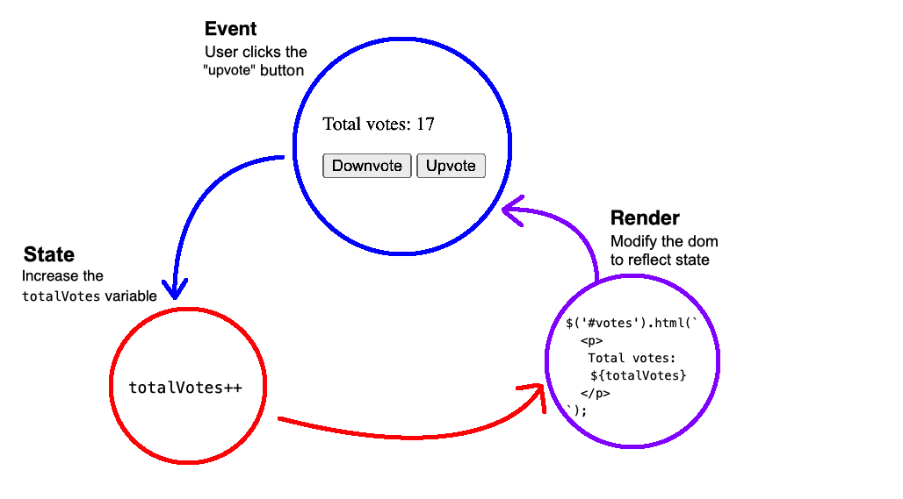

# The Pattern: Event -> State -> render

[Starter repo](https://github.com/PrimeAcademy/event-state-render-starter)

As you write more and more code, you will come to notice certain **_patterns_ that are repeated over and over across different projects.** Learning to identify to reuse patterns is a kind of coding super-power: better to tweak some existing software design that works, than to start all over again!

Certain patterns have become ubiquitous in programming. In fact, you can find [whole books of "software design patterns"](https://www.amazon.com/s?k=software+patterns): you just need to know which ones to use, and when.

Today, we'll introduce a pattern that is very popular for web apps: **Event -> State -> Render**

> **NOTE:** In tech jargon, that pattern is more often called **Model -> View -> Controller** or MVC. But we'll continue to use the terms _Event -> State -> Render_ through the next few weeks.

**You will be using this pattern throughout the entire program,** even as we segue into servers, databases, and other JS frameworks. This pattern even applies outside of javascript, so you will likely be using a variation of it at future jobs!

## Event -> State -> Render



On the whiteboard:


## Event === User Interactions

**Everything that _happens_ in a web app is triggered by some user interaction:** clicking a button, typing text into a form field, moving the mouse, etc. 

In code, **we call those interactions "events".** The job of our of code is to "handle" or respond to user events:

```js
$(document).ready(onReady);

function onReady() {
    // Setup an event handler
    // so that when the user clicks on the "Upvote" button
    // we will run the code in the `onUpvote` function
    $('#upvoteBtn').on('click', onUpvote);
}

function onUpvote() {
    // Event handler code goes here 👇
}
```

We can put whatever kind of code we want in that event handler function. But often, we'll **respond to user interactions by _updating state_.**

## State === Data

When we talk about "state", we're talking about **all the properties that describe what our application currently looks like**. For this small use case, the main thing we need to know is: how many upvotes are there?

```js
// This variable is our application state state!
let totalVotes = 0;
```

State can be more complicated than just a number: consider the "state" of yourself right now. Are you tired? hungry? interested? bored? what's on your mind?  We could bundle up all of these descriptors, and call them "the state of <your name>":

```js
let theStateOfYou = {
    tired: false,
    energized: true,
    hungry: true,
    bored: false,
    onYourMind: ['code', 'food', 'getting a job']
}
```

As you see here, we can represent the state of anything using JS values: objects, arrays, strings, numbers, and booleans.

When a user interacts with the app (event), we will **update the app's _state_ to reflect the user's intent:**

```js
// Any variable can be used to represent state.
// In this case our variable is just a number
let totalVotes = 0;

$(document).ready(onReady);

function onReady() {
    // Setup an event handler
    $('#upvoteBtn').on('click', onUpvote);
}

function onUpvote() {
    // The user's intent is to increase the total vote count
    // We will update the state (totalVotes) so it matches
    // what the user wants
    totalVotes++;
}
```

Great! We now have data in our state variable that matches the user's intent. But there's nothing for the user to _see_ yet. For that, we need to _render to the DOM_.

## Render === Updating the DOM

The last step of this process is to present our state data in a way that users can see. In web development, that means _rendering to the DOM_.

> NOTE: **we use the word "render" in software to mean taking raw data and converting it something visible to users.** In web development, that will always involve HTML and DOM manipulation.

```js
// Handle upvote event
function onUpvote() {
    // Update state
    totalVotes++;

    // We can use jQuery to manipulate the DOM 💪
    // Here, we're changing the html content of the <div id="votes"> element
    // to show the newest value of totalVotes
    $('#votes').html(`
        <p>
            Total votes: ${totalVotes}
        </p>
    `);
}
```

### A separate `render()` function

What if we want to handle downvotes, too:

```js
$(document).ready(onReady);

function onReady() {
    $('#upvoteBtn').on('click', onUpvote);

    // NEW: Add an event handler for downvotes
    $('#downvoteBtn').on('click', onDownvote);
}

// Handle upvote events
function onUpvote() {
    // Update state: increase vote count
    totalVotes++;

    // Render to the DOM
    $('#votes').html(`
        <p>
            Total votes: ${totalVotes}
        </p>
    `);
}

// Handle downvote events
function onDownvote() {
    // Update state: decrease vote count
    totalVotes--;

    // Render to the DOM
    $('#votes').html(`
        <p>
            Total votes: ${totalVotes}
        </p>
    `);
}
```

Notice how there's duplicate logic for rendering in our event handlers? Let's pull that out into it's own function:

```js
// Handle upvote event
function onUpvote() {
    // Update state: increase vote count
    totalVotes++;

    // Render to the DOM
    render();
}

// Handle downvote event
function onUpvote() {
    // Update state: decrease vote count
    totalVotes++;

    // Render to the DOM
    render();
}

function render() {
    $('#votes').html(`
        <p>
            Total votes: ${totalVotes}
        </p>
    `);
}
```

You can see that each event handler follows the pattern of Event -> State -> Render: 

1. Handle a **user interaction (event)**
2. Update the **state** to match the user's intent
3. **Render** the latest value of state to the DOM

This keeps our code cleaner. It also allows us to think about these operations in isolation: the job of the event handler is simply to update state. The job of the `render()` function to update our DOM to match whatever the current state is.

Going forward, **all of your jQuery code will follow a similar pattern**:


```js
// Create a state variable here:
let state = ....;       // state can be anything!

$(document).ready(onReady);

function onReady() {
    // Setup event handlers here
}

// One or more event handler functions
function onSomethingOrOther() {
    // Update state...

    // Render your updated state
    render();
}

// The render function updates the DOM, 
// using the data in our state variable
function render() {
    // Use jquery functions like 
    // .html(), .append(), .remove() .addClass(), etc
    // to modify the DOM. 
}
```

Of course there will be variations on this theme and new tech to plugin (servers and databases!), but the basic structure of your apps will largely stay the same.


## Render when the page loads

We still have some **code duplication** here:

```html
<!-- index.html -->
<div id="votes">
    <p>
        Total votes: 0
    </p>
</div>
```

```js
// votes.js
function render() {
    $('#votes').html(`
        <p>
            Total votes: ${totalVotes}
        </p>
    `);
}
```

To fix this, we can remove that code from our HTML, and call `render()` when the page loads:

```html
<!-- index.html -->
<div id="votes"></div>
```

```js
// votes.js
function onReady() {
    // Render when the page loads
    render();

    // .... event handlers ...
}
```

## More fun with render()

Often, our `render()` function will use `.html()` or `.append()` to generate HTML. But it can do more, if we need!

Let's say we want to re-style the `#votes` div if there are more than 50 votes:

```js
function render() {
    $('#votes').html(`
        <p>
            Total votes: ${totalVotes}
        </p>
    `);

    // We can do more than just generate HTML!
    if (totalVotes > 50) {
        $('#votes').addClass('lots-of-votes');
    }
    else {
        $('#votes').removeClass('lots-of-votes');
    }
}
```

```css
.lots-of-votes {
    border: 3px solid red;
    font-weight: bold;
}
```
