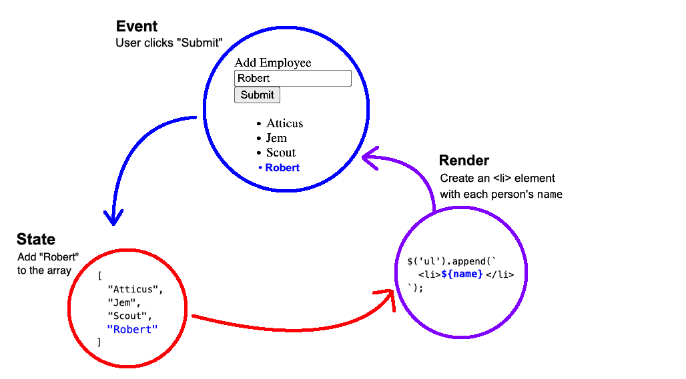

### Rendering Lists

[Starter repo](https://github.com/PrimeAcademy/event-state-render-starter)



**Most apps deal with lists of things:** Facebook wouldn't have been so successful if users could only have one post or one friend. 

And, most often, each item in the list has multiple properties: eg, the content of the post, who posted it, the date, etc.

In javascript, we represent this type of data using **arrays of objects:**

```js
// An array of posts
[
    // Each post is an object
    {
        content: 'You only #yolo once',
        author: 'techWhiz3791',
        date: 'Jan 19, 2014'
    },
    // Another post!
    {
        content: 'More kid pics!',
        author: 'proudParent3280',
        date: 'Mar 14, 2014'
    },
]
```

We can work with this data structure using our Event -> State -> Render pattern. We'll just need to think through how we work with our state variable:

```js
// Our state variable will be an array of objects
// When the app first loads there are no posts, so it is an empty array
let posts = [];

$(document).ready(onReady);

function onReady() {
    $('#submitBtn').on('click', onSubmitPost);
}

// Event handler
function onSubmitPost() {
    // Get the data from the <input> elements
    // and create a "post" object
    let post = {
        content: $('#contentInput').val(),
        author: $('#authorInput').val(),
        date: $('#dateInput').val(),
    };

    // Add the new post object to our array (state)
    posts.push(post);

    // Render the posts array
    render();   // TODO
}
```

There's a bit more code here, but it's the same idea. We update our state variable, based on some user interaction.

Now we need to render our array of objects:

```js
function render() {
    // We're going to wipe our DOM element clean,
    // then add each item back into it
    $('#postsTable').empty();

    // Loop through the posts, and render each one
    for (let post of posts) {
        $('#postsTable').append(`
            <tr>
                <td>${post.content}</td>
                <td>${post.author}</td>
                <td>${post.date}</td>
            </tr>
        `);
    }
}
```

You might wonder why we wipe the DOM element clean each time we render, instead of just appending the post. This way, the render function will work whether we're adding a post, deleting a post, or editing a post. Whatever is in the `posts` array is what we'll see on the DOM! 

## Reminder: State can be anything!

While it is very common for state to contain a list of objects, state can be any kind of variable or data structure! If it makes more sense for your application to use a number, string, boolean, or object, do that.

You could even have multiple variables holding different pieces of application state:

```js
// Track posts
let posts = [];

// Track "dark mode"
let isDarkMode = false;

function onReady() {
    // ...
    
    $('#dark-mode').on('change', onDarkModeChange);
}

function onDarkModeChange() {
    // .is(':checked') returns a boolean
    // indicated of if a checkbox is checked
    isDarkMode = $(this).is(':checked');
}

function render() {
    // Render posts
    $('#postsTable').empty();
    for (let post of posts) {
        $('#postsTable').append(`
            <tr>
                <td>${post.content}</td>
                <td>${post.author}</td>
                <td>${post.date}</td>
            </tr>
        `);
    }

    // Render "dark mode"
    if (isDarkMode) {
        $('body').addClass('dark-mode');
    }
    else {
        $('body').removeClass('dark-mode');
    }
}
```