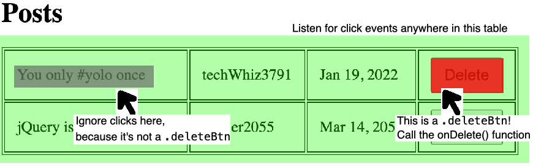
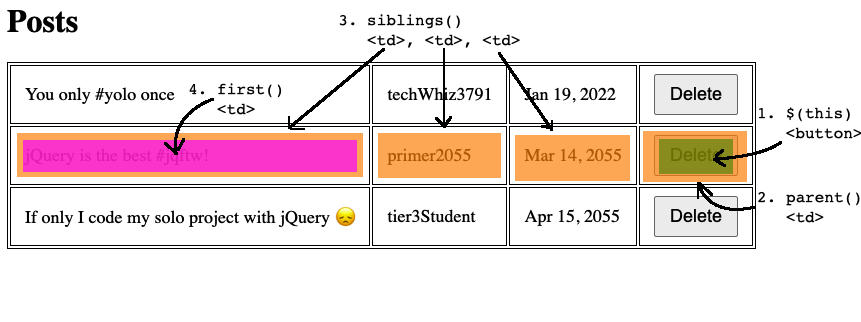

# Removing Items from lists

We can use the same Event -> State -> Render pattern to remove items from a list. 

Let's update our _Posts_ app to allow users to delete a post:

- **Event**: User clicks a _Delete_ button, next to the post they want to delete
- **State**: Remove the selected Post object from the `posts` array
- **Render**: Re-append the `<li>` elements for each post, with the selected item removed

## Event: The Delete Button

We'll need to render a _Delete_ button next to each post:

```js
function render() {
    // Empty the <table>
    $('#postsTable').empty();

    // Loop through the posts, and render each one
    for (let post of posts) {
        $('#postsTable').append(`
            <tr>
                <td>${post.content}</td>
                <td>${post.author}</td>
                <td>${post.date}</td>
                <!-- 👇 NEW 👇 -->
                <td>
                    <!-- Give it a class, so we can target it with jQuery -->
                    <button class="deleteBtn">
                        Delete
                    </button>
                </td>
            </tr>
        `);
    }
}
```

Note that we use a `class` instead of an `id` to identify the delete button. This is because **you cannot have multiple elements with the same `id`.**

Time to add the event handler:

```js
function onReady() {
    // ...

    $('.deleteBtn').on('click', onDelete);
}

function onDelete() {
    console.log('in onDelete');
}
```

But it's not working 🤔

The problem is that the `<button class="deleteBtn">` elements do not exist yet when the page loads, in `onReady()`:

```js
function onReady() {
    console.log('looking for delete buttons:', $('.deleteBtn'));
    // 👆 this will show an empty array of jQuery objects
    // ie, it can't find any element with class="deleteBtn"
}
```

We need a way to tell jQuery: "Hey, these buttons don't exist _yet_, but when they do, please handle click events for them".

### Event delegation

We're going to be a little clever here:

- Setup a click event handler on the entire `<table>` element (which does exist on page load)
- When a user clicks anywhere on the `<table>`, look at the specific element _inside_ the table that they're clicking on
- If that element is a `.deleteBtn` element, call `onDelete()`. Otherwise, ignore it.



This is called [**event delegation**](https://learn.jquery.com/events/event-delegation/)

While it sounds tricky, jQuery makes it easy for us:

```js
// Just like a normal event handler, but with an extra argument
$('#someParentElement').on('click', '.theActualElementYouWant', yourHandlerFn);
```

So for us this will look like:

```js
function onReady() {
    // ...

    // Listen for any clicks on the `<table>`
    // but only do something about clicks that target the `.deleteBtn` 
    $('#postsTable').on('click', '.deleteBtn', onDelete);
}

function onDelete() {
    console.log('in onDelete');
}
```

Et voila, event delegation!

## State: Remove an item from an array

Next step is to update state, by removing the selected post from the `posts` array. At this point, if we `console.log()` our state, it will look something like:

```js
[
    {
        content: 'You only #yolo once',
        author: 'techWhiz3791',
        date: 'Jan 19, 2022'
    },
    {
        content: 'jQuery is the best #jqftw!',
        author: 'primer2055',
        date: 'Mar 14, 2055'
    },
    {
        content: 'If only I could use jQuery in my solo project 😞',
        author: 'tier3Student',
        date: 'Apr 15, 2055'
    }
]
```

Let's say we want to remove that second post, which says _jQuery is the best #jqftw!_. Here's how we'll approach this:

- Figure out which delete `<button>` we clicked on (remember, there are three of them!)
- Get the post `content` of that table row as a string, using `.text()`
- Find the object inside the `posts` array with that same `content` property, and remove it from the array

```js
function onDeletePost() {
    // Figure out which delete `<button>` we clicked on
    // In jQuery, $(this) is the specific element that was clicked!
    let deleteBtn = $(this);

    // Next: Get the post `content` of that table row as a string
}
```

Next we need to find the post content. Let's inspect the HTML of that table row, on the DOM:

```html
<tr>
    <!-- 👇 We want to find this <td> element -->
    <td>                 
        jQuery is the best #jqftw!
    </td>
    <td>primer2055</td>
    <td>Mar 14, 2055</td>
    <td>
        <!-- 👇 We have access to $(this) button element -->
        <button class="deleteBtn">
            Delete
        </button>
    </td>
</tr>
```

We will use **DOM Traversal** to get from the delete button (`$(this)`) to the `<td>` element. DOM traversing means that we are **walking from one DOM element to another** using jQuery methods.

Remember that the DOM is our HTML document represented as a tree:


jQuery gives us methods to move from one element of the tree to another:

- `.parent()` returns the element "above" us on the tree
- `.children()` returns all the elements directly "below" us on the tree
- `.siblings()` returns all the elements next to us on the tree

Let's use these to get from our delete `<button>` to the `<td>` with the post content:




```js
function onDeletePost() {
    let contentToDelete = $(this)   // 1. The delete <button>
        .parent()                   // 2. The <td> above the button
        .siblings()                 // 3. All the <td>s in the same row
        .first()                    // 4. The first of those <td>'s
        .text();                    // 5. The text content of that <td>

    console.log(contentToDelete);
    // "jQuery is the best #jqftw!"

    // Next: remove the post with that content 
    // from the `posts` array
}
```

Removing an object from an array is more work than adding an object:

```js
// Create a new array for our updated posts
let newPosts = [];

// Loop through the old array
for (let post of posts) {
    // Add any items that *don't* match `contentToDelete` into the new array
    if (post.content !== contentToDelete) {
        newPosts.push(post);
    }
}

// Replace the old posts with the new posts
posts = newPosts;

// 😅 whew, that was tricky! 
// But now that our state is where we want it,
// our render() function will take care of the rest 💪
render();
```


## Final code

```js
// Our state variable will be an array of objects
let posts = [];
$(document).ready(onReady);

function onReady() {
    // Handle submit button clicks
    $('#submitBtn').on('click', onSubmitPost);

    // Handle delete button clicks
    // using event delegation
    $('#postsTable').on('click', '.deleteBtn', onDeletePost)
}

// Event handler for submitting posts
function onSubmitPost() {
    // Get the data from the <input> elements
    // and create a "post" object
    let post = {
        content: $('#contentInput').val(),
        author: $('#authorInput').val(),
        date: $('#dateInput').val(),
    };

    // Add the new post object to our array
    posts.push(post);

    // Render the posts array
    render();
}

function onDeletePost() {
    // Get the post `content` of that table row as a string, using `.text()`
    let contentToDelete = $(this)   // 1. The delete <button>
        .parent()                   // 2. The <td> above the button
        .siblings()                 // 3. All the <td>s in the same row
        .first()                    // 4. The first of those <td>'s
        .text();                    // 5. The text content of that <td>

    console.log(contentToDelete);
    // "jQuery is the best #jqftw!"
    
    // Loop through the old array
    for (let post of posts) {
        // Add any items that *don't* match `contentToDelete` into the new array
        if (post.content !== contentToDelete) {
            newPosts.push(post);
        }
    }

    // Replace the old posts with the new posts
    posts = newPosts;

    // Render the new posts array
    render();
}

function render() {
    // We're going to wipe our DOM element clean,
    // then add each item back into it
    $('#postsTable').empty();

    // Loop through the posts, and render each one
    for (let post of posts) {
        $('#postsTable').append(`
            <tr>
                <td>${post.content}</td>
                <td>${post.author}</td>
                <td>${post.date}</td>
                <td>
                    <button class="deleteBtn">
                        Delete
                    </button>
                </td>
            </tr>
        `);
    }
}
```