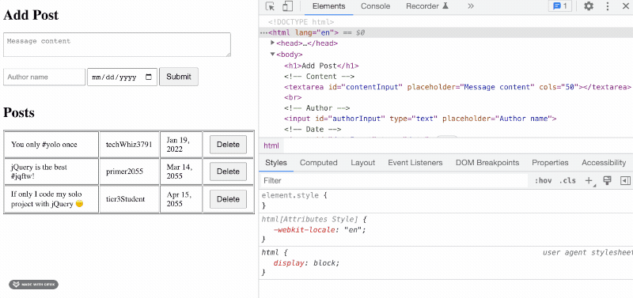

# CSS Basics

**Context**

Design and front-end may or may not be your "thing". But almost _every_ software engineer will need to work on front-ends with CSS at some point.

Coding _beautiful_ websites is not a requirement, but **you will need to design web pages that are usable, accessible, and professional**.

## HTML vs. CSS vs. JS

- HTML is the content
- CSS styles the content
- JS makes the content interactive

CSS works by _targeting_ HTML elements on the DOM, and applying style rules to them.

> Where else have we talking about targeting elements on the DOM....? jQuery! **CSS and jQuery use the same _selectors_ **

## Common Element Selectors

See the [Full Reference at w3schools](https://www.w3schools.com/cssref/css_selectors.asp)

Selector | Example | Description
--- | --- | ---
element | div | Selects all elements with that tag
[.class](https://www.w3schools.com/cssref/sel_class.asp) | .intro | Selects all elements with class="intro"
[#id](https://www.w3schools.com/cssref/sel_id.asp) | #firstName | Selects the element with id="firstName"
 [*](https://www.w3schools.com/cssref/sel_all.asp) | * | Selects all elements
[element](https://www.w3schools.com/cssref/sel_element.asp) | p | Selects all 
 elements
[element within another element](https://www.w3schools.com/cssref/sel_element_element.asp) | div p | Selects all 
 elements inside 
 elements
| [multiple elements](https://www.w3schools.com/cssref/sel_element_comma.asp) | h1, h2, h3 | select all these elements

## Box Model

If you inspect an element with your browser, you can see a representation of the box model. Everything rendered on the page is a box. These boxes have properties and this is called **The Box Model**.

The parts of the box model are:

- `Content` - The content of the box, where text and images appear.
- `Padding` - Clears an area around the content but inside the element's box. The padding is transparent. Gives us space **inside** the box.
- `Border` - A border that goes around the padding and content
- `Margin` - Clears an area outside the box and border. The margin is transparent. Margin gives us space **between** elements.

## CSS properties to know!

**IMPORTANT: We will not teach you all the CSS properties, tricks, or tools that you will need to know!** 

You will need to ***do your own research!*** 

- margin
- padding
- border
- height
- width
- display (block, inline, flex, grid, none)
- background-color
- font (size, weight, color)

## Block vs. inline

- `display: block` elements take up the entire width of the page
- `display: inline` elements are as wide as they need to be
    - Cannot use padding, margin, width, or height!
- `display: inline-block` elements are as wide as they need to be, but _can_ use padding, margin, width, height. 

## The most common CSS question: HOW DO I CENTER?

Many options to center things. Thats part of the problem. This decision tree is very helpful:

- [Centering In CSS](https://css-tricks.com/centering-css-complete-guide/)

In short:

- `text-align: center` centers the _content_ of the element (text and child elements)
- `margin: 0 auto` centers the element itself, inside of its parent element (must be `block` or `inline-block`)
- Consider flexbox!

## Dev Tools: The Elements Panel

Use the _Elements_ panel in chrome dev tools to help you write and "debug" CSS:

Note that changes in dev tools **do not save** to your actual `.css` file. You will need to manually copy/paste changes.

Chrome gives you a lot of tools to help you write CSS. Having trouble remembering all the flexbox properties? 

## Learning Resources

Flexbox and CSS Grid are hard, but also super powerful! These are online "games" to help you learn them:

- [Flexbox Froggy](https://flexboxfroggy.com/)
- [CSS Grid Garden](https://cssgridgarden.com/)
