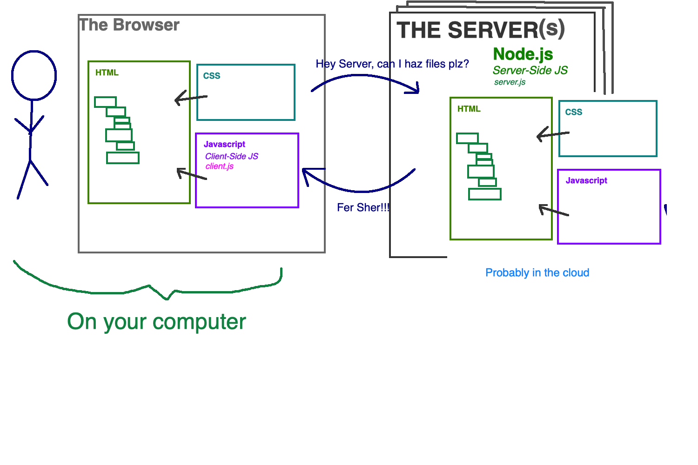

# Express Intro

## Full Stack

### Background



```
,________,         .------,    |      .------,         .------.
|________|       ,'_____,'|    |    ,'_____,'|        (        )
|        |       |      | |    |    | ____ | |        |~------~|
|        |       |      | |    |    | ____ | |        |~------~|
|        |       |      | ;    |    | ____ | ;        |~------~|
|________|       |______|'     |    |______|'         `.______.'
 HTML/CSS       JS / jQuery    |  Node / Express       Database
                               |                   
           CLIENT              |             SERVER           
```

### How does the internet work?
Up to this point, we've been using our local computer to help *serve* files. But no one else could access them. 
The internet is possible because we tell a computer that it expects to get connections from other computers. 
The computers expecting connections are called Servers. 
In order to have your computer expect connections, we need code.
**Client** code runs in the _browser_. **Server** code runs on the _server_ (in the cloud).

When you go to www.google.com, you are connecting to a server.  
That server is expecting you, and *serves* you back the static index.html. 
It also can *serve* your static assets -- images, css, js, fonts, etc. 

Today, we will be building your first static file server. WOAH!


> **NOTE:** Project names (when running `npm init`) can not have capital letters or spaces.

[Express](https://expressjs.com/) is a Node.js web application framework. It simplifies the process for accepting requests and returning responses on the server. Express allows us to respond to URLs.

## Setup Instructions
1. Create a new repository on GitHub with a project name (initialize with a README.md)
2. Clone the repo on to your computer
3. Create a `.gitignore` file and ignore `node_modules/`, `.DS_Store` and `*.log`
  
  **.gitignore**

  ```
  node_modules/
  .DS_Store
  *.log
  ```
  
  ## Make a Static Server Steps
 - Get our folders and files in place
 - Allow for incoming requests to be accepted
 - Respond with our assets
  
4. Create your folder structure:

  ```
  salary-calculator-server/
  ├── server/
  │   ├── public/
  │   │   ├── scripts/
  │   │   │   └── client.js
  │   │   ├── vendors/
  │   │   │   └── jquery.js
  │   │   ├── styles/
  │   │   │   └── style.css
  │   │   └── index.html
  │   └── server.js
  ├── node_modules/
  │   ├── express/
  │   └── ...
  └── .gitignore
  ```

  > NOTE: The `node_modules` folder is auto generated.

5. In the project folder, run `npm init --yes`
6. Install express `npm install express`
7. Install body-parser (for anything with a post) `npm install body-parser`
    - Don't forget to add `app.use(bodyParser.urlencoded({extended: true});`
8. If you made a mistake, that's ok, you can always `npm uninstall some-thing`

## NPM

Notice above we are using a program called `npm` to install things called 'packages.'

[Node Package Manager](https://www.npmjs.com/) 

>npm is the package manager for JavaScript and the world’s largest software registry. Discover packages of reusable code — and assemble them in powerful new ways.

NPM allows us to use code written by others or even to share our own Node project. Much like we use jQuery, which is code written by someone else to save time and effort. NPM is a registry (and a tool) to help manage and access a ton of pre-made code. In fact, we can install jQuery using `npm`! Most popular packages can be installed via the `npm` tool.

## Setup Our Server

### Rebooting a Node Server
- `ctrl-c`

**server.js**

```JavaScript
// Require express - gives us a function
const express = require('express');

// Create an instance of express by calling the function returned above - gives us an object
const app = express();
const port = 5000;

// express static file serving - public is the folder name
app.use(express.static('server/public'));

// Start up our server
app.listen(port, () => {
  console.log('listening on port', port);
});
```

At this point we could start our server using `node server/server.js`. To simplify things we can add the following line to our `package.json` file.

**package.json**

```json
  "scripts": {
    "test": "echo \"Error: no test specified\" && exit 1",
    "start": "node server/server.js"
  },
```

## Add HTML, CSS & JavaScript

For this example, use your weekend assignment. Bring in the HTML, CSS, jQuery and JavaScript files to use for testing.

## Testing the Server

You should be able to run your code by navigating to [http://localhost:5000](http://localhost:5000).


