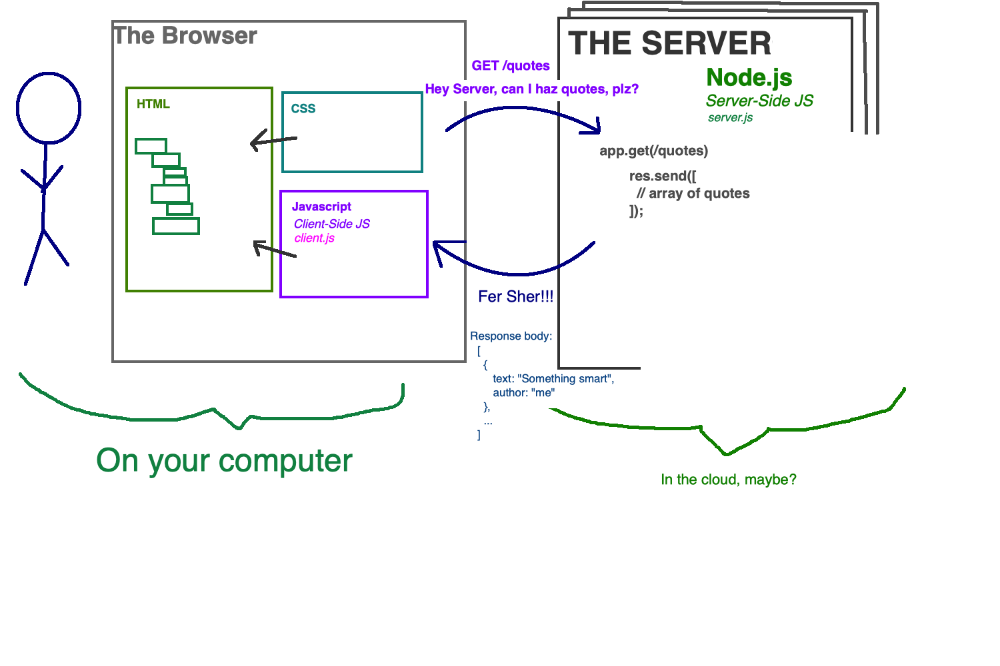

# Express GET Requests

In addition to sending back static files, we can also send back *dynamic* data. 



Let's make an application to get an inspirational quote! 

Start by setting up Express in our `server.js`:

**server.js**
```JavaScript
let express = require('express');
let app = express();
const PORT = 5000;

// Setup express.static files
app.use(express.static('server/public'));

app.listen(port, function(){
    console.log('listening on port', PORT);
});
```

Let's add some quotes in an array, so we have some data to work with:

```JavaScript
let quoteList = [
    { text: 'I\'m not going to school just for the academics - I wanted to share ideas, to be around people who are passionate about learning.', author: 'Emma Watson' },
    { text: 'Remember there\'s no such thing as a small act of kindness. Every act creates a ripple with no logical end.', author: 'Scott Adams' },
    { text: 'Intelligence plus character-that is the goal of true education.', author: 'Martin Luther King, Jr.' }
];
```

Now let's setup a way to get those quotes back from the server. We will setup a `route` or URL that will send back data on request.

```JavaScript

// When we visit http://localhost:5000/quotes
// in our browser, express will call this function
app.get('/quotes', function(req, res) {
    console.log('Request for /quotes was made');

    // Send back the list of quotes
    // so we can see it in our browser
    res.send(quoteList);
});
```

When we make a request to `http://localhost:5000/quotes`, we will see the list of quotes, as an array.

## Terminology

Let's go over the different pieces of this express code.

**Route / Path / URL**

This is the URL that we visit to get quotes from the server. In this case the _route_ is `/quotes`. We'll use the terms _route_, _path_, and _URL_ somewhat interchangeably.

It is a convention that the route is a _noun_, which describes _what_ kind of data you are working with.

In express, the route is the first argument to `app.get()`:

```js
app.get('/quotes', function(req, res) {
//       ^ this is the route!
```

**Method**

This is your _verb_ -- it describes _how_ you want to interact with the route. In our case, we want to _get_ quote data from our server, so our method is `GET`. The most common methods are:

- `GET`: retrieve data from the server
- `POST`: save new data to the server
- `PUT`: update some data on the server
- `DELETE`: delete some data on the server

For this week, we'll mostly be dealing with `GET` and `POST`.

In express, the _method_ is the function name, as in `app.<method>()`

```js
app.get('/quotes', function(req, res) {
//  ^ this is the method!
```

**Request**

A _request_ is what the _client_ (browser) sends to the server. The request includes a _route_, a _method_, and, optionally, a body.

To access information about the request, we can use the `req` argument to our express callback:

```js
app.get('/quotes', function(req, res) {
    // `req` is an object with all sorts of information
    // about the request
})
```

**Response**

A _response_ is what the _server_ sends back to the client (browser). The response includes a status code, and optionally a body.

In express, we use the `res` argument to send a response:

```js
app.get('/quotes', function(req, res) {
    // `res.send()` sends data back to the client
    res.send(quotes)
})
```


**Request / Response Body**

A body is the data sent from the server to the client (or vice-versa). In our case, we're sending the `quotes` array back to the client, as the response body.

```js
app.get('/quotes', function(req, res) {
    // Whatever we pass to `res.send()` is the response body
    res.send(quotes)
})
```

**Status Code**

Every response comes with a _status code_. This is a shorthand for telling the client about the status of the request.

Common status codes are:

- `200 OK`: Everything is A-OK!
- `201 Created`: The server created some new data for you
- `400 Bad Request`: The client sent some bad data
- `404 Not Found`: That URL or endpoint is not available
- `500 Server Error`: Something bad happened on the server.

By default `res.send()` uses a `200` status code. But we can change the code:

```js
app.get('/quotes', function(req, res) {
    res.status(400).send('That request was not valid!');
})
```

...or _just_ send back a status (with no body)

```js
app.get('/quotes', function(req, res) {
    // Something bad happened.... panic!
    res.sendStatus(500)
})
```

**API**

API is short for "Application Programming Interface", but it basically means "a way for programs to communicate with each other". In our case, we're talking about a web server that can send data back and forth to a client. 

Congratulations, you just built your first API!

**HTTP**

HTTP is the specification that describes everything we just talked about. So the fact that a request is made of a route and a method, etc... this is all described in the HTTP spec. 

### Modules!

Modules are a way to organize server side code. They allow us to group functionality and re-use it throughout our application.

Let's update our quotes application to move the quotes data into a module!

**server.js**
```JavaScript
let express = require('express');
let app = express();
const PORT = 5000;

// Setup express.static files
app.use(express.static('server/public'));

// Bring in the quotes module
const quoteList = require('./modules/quoteList');

// GET route - gets next quote to show
app.get('/quotes', function(req, res) {
    console.log('GET Request for quotes');
    res.send(quoteList);
});

app.listen(PORT, function(){
    console.log('listening on port', PORT);
});
```

**modules/quoteList.js**
```JavaScript
let quoteList = [
    { text: 'I\'m not going to school just for the academics - I wanted to share ideas, to be around people who are passionate about learning.', author: 'Emma Watson' },
    { text: 'Remember there\'s no such thing as a small act of kindness. Every act creates a ripple with no logical end.', author: 'Scott Adams' },
    { text: 'Intelligence plus character-that is the goal of true education.', author: 'Martin Luther King, Jr.' }
];


module.exports = quoteList;
```

