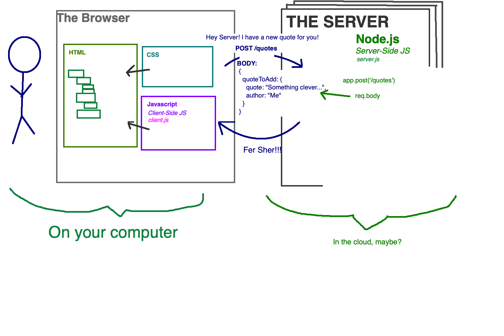

# Express POST Requests

Earlier we looked at how to request data from our server. Now we'll look at how to add new data to the server.



## Server setup

We need to do some extra configuration with our server to *parse* data sent from the client. To do this, we'll use a library bundled in Express called `body-parser`. 

```JavaScript
let bodyParser = require('body-parser');
app.use(bodyParser.urlencoded({ extended: true }));
```

## Create a Post Route

The *method* name sets the server up to listen for specific types of requests.  Earlier we setup a route to listen for `GET` requests. 

Now we will setup a route to listen for POST requests.

```JavaScript
app.post('/', (req,res) => {
    // The data (body) sent from the client is saved for us
    // in `req.body`
    // Note that without bodyParser setup, req.body will be undefined!
    console.log(`Get a POST request!`, req.body);

    // Grab the new quote from the request body
    let quote = req.body.quoteToAdd;

    // Push the quote into our array
    console.log(`Adding new quote: `, quote)
    quoteList.push(quote);

    // Send back a status code of 201
    res.sendStatus(201);
});
```

But wait! We could test the GET request in the browser by typing in the URL. We can't do that for a POST request. How do we test this? Postman to the rescue!
