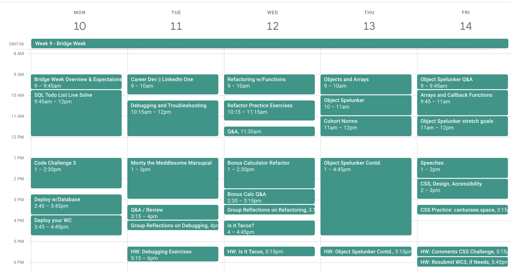

# Bridge Week Overview

This week is intended to pause on the technologies we've learned so far: Fullstack CRUD app with jQuery, Node, and Express, using HTTP requests and REST API. We will spend our time strengthening student understanding of fundamental JavaScript, programming concepts, syntax, and debugging skills.

For students who are falling behind, this is the week to catch up!

**Students must complete/resubmit Weekend Challenges and Code Challenges this week to continue with the program.**

## Week Objectives

- Complete/Fix any previous Tier 2 graded assignments
- Practice using complex data structures
- Practice methodic debugging skills using the debugger
    - Using Define, Isolate, Fix process 
- Think critically about programming topics and discuss them
- Reduce stress of cohort by focusing on deeper skills, not new technologies
- Reduce stress of instructor by focusing the week's work on working directly with students on the basics

### Vocabulary/Key Terms

- Review of key terms from previous weeks
    - CRUD, REST, Request/Response, HTTP request, server, status code
- Debug
    - Define, Isolate, Fix
- Debugger
- Data Structure

## 1 on 1 Topics

## Speech Topics

## Schedule

The schedule is flexible for this week, and instructors may pick and choose content areas that best match their cohort and inclinations. 

Here is a good baseline schedule to start from. If this is your first time teaching Bridge Week, start here!

## Homework

For students who are behind on previous content, **evenings are their time to catch up!**

**Students must complete and resubmit any "Needs Improvement" weekend or code challenges** by Thursday at 9am this week. This takes precedence over homework. 

For other students, homework assignments will be available to reinforce the day's content. Instructors may also choose to assign code challenges (eg, from codewars.com) for homework.

## Assignments

### Debugging

- [Monty the Meddlesome Marsupial](https://github.com/PrimeAcademy/monty-marsupial-debugging)
    - BUG HUNT
    - Koala Holla completed Fullstack CRUD app with lots of bugs in it
    - Even set-up is broken
    
- [Debugging Exercises](https://github.com/PrimeAcademy/debugging-exercises)
    - External resources for practicing debugging
    - Look at some broken code, and try to find the bug.

### Refactoring

- [Refactor Micro Challenges](https://github.com/PrimeAcademy/refactor-micro-challenges)
  - Multiple small exercises to practice the mechanics of refactoring

- [Bonus Calculator Refactor](https://github.com/PrimeAcademy/bonus-calculator-refactor)
  - Starting point: solved Bonus Calculator app (from T2W1)
  - Extract code into new functions
  - Includes discussion questions, to reflect on refactoring

- [Is It Tacos?](https://github.com/PrimeAcademy/is-it-tacos)
    - Starts with a completed fullstack app with files and variables renamed
    - Students must fix all the variables naming
    - Students often get mixed up when working with functions, does the argument name need to match the variable name it was called with, etc. Same with node imports, object property names

### Data Structures

- [Object Spelunker](https://github.com/PrimeAcademy/object-spelunker)
    - Practice with large, complex, nested object
    - Includes Jest-based unit tests for running/testing output

### CSS, Design, and Accessibility

- [Can't Unsee](https://cantunsee.space/)
  - External resource
  - Online game: given two web component designs, choose the most "correct" design
  - Practice attention to detail and design conventions

### CRUD / REST Patterns

- [Enti-Tees](https://github.com/PrimeAcademy/entitees-crud-app-design)
    - Simulates planning phase of T3 Client project
    - Fake client (instructor) presents set of requirements
    - Students must:
      - Identify the entities in the app
      - Break down CRUD requirements for each entities
      - Design a DB structure (ERD)
      - Plan out API Endpoints

 

## Challenges

- Weekend: [Comments Section CSS Challenge](https://github.com/PrimeAcademy/comments-css-challenge)
    - Adapted from Frontend Masters: https://www.frontendmentor.io/challenges/interactive-comments-section-iG1RugEG9
    - **NOT GRADED**

- No Code Challenge next Monday

## Activities

Many of the assignments have a discussion/what did you learn section that is well worth the time. Stress to your students to think critically about the topics at hand. 