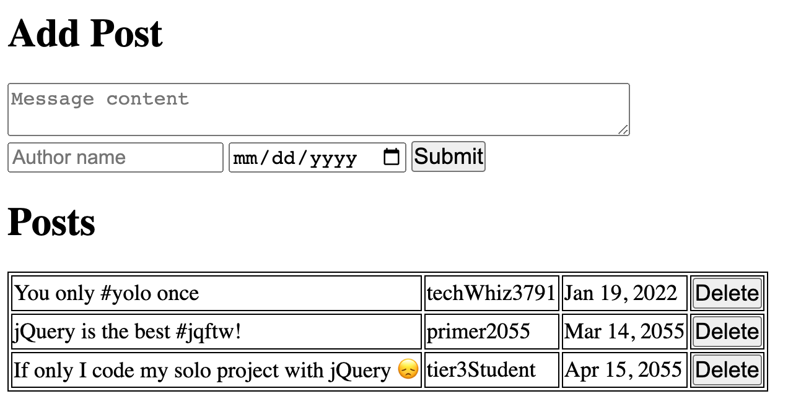
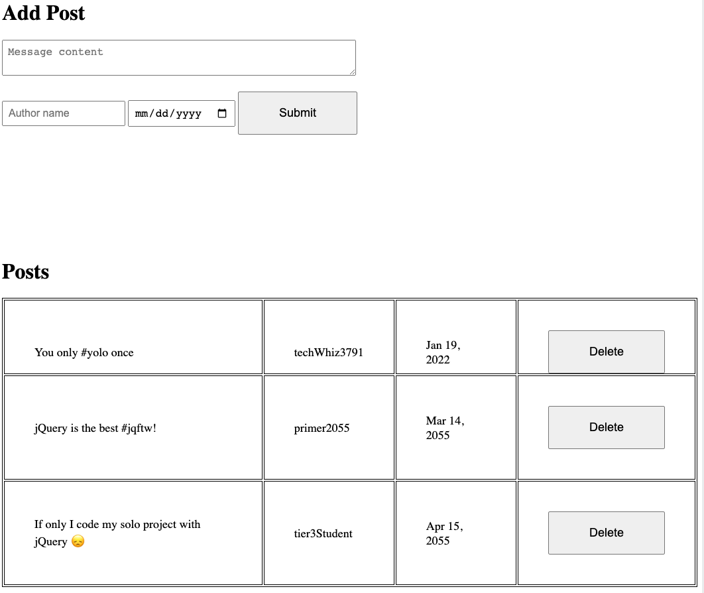
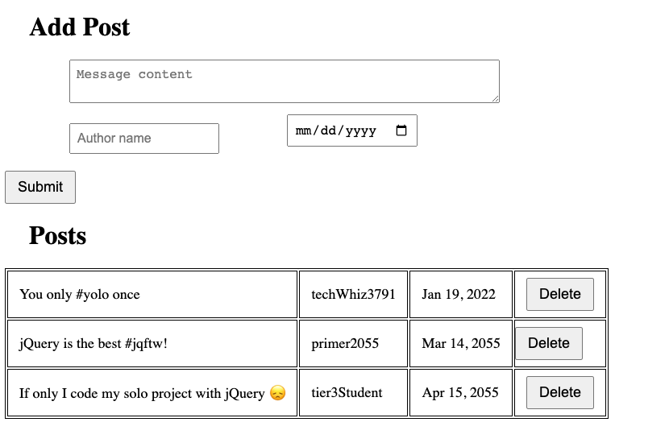

# Web Design 101

[Starter Code](https://github.com/PrimeAcademy/event-state-render-starter)

## Objectives

- Learn **basic, practical design skills** to make a web app look professional
- Use **spacing** to give elements "room to breath"
- **Align** elements to keep the app clean
- Use **visual hierarchy** to structure content

## Padding and Spacing

The number 1 thing you can do to make your website look cleaner and more professional is to **give your elements some space!** Crowded content looks tense, and makes the user feel tense. Loosen up, give your site some room to breath 🌬️

**❌ Bad Example: Too crowded!**

**✅ Good Example: Room to Breathe**

**❌ Bad Example: Too much negative space!**

Every element deserves a bit of padding. But use it in moderation: you want things to feel roomy, but still cohesive.

## Alignment

Things that go together should be visually aligned.

**❌ Bad Example: Out of Alignment**

**✅ Good Example: In Alignment**

## Hierarchy of Content

There should be a clear hierarchical structure in your page design. eg:

1. Page Title: biggest / most prominent, `<h1>`
2. Section Title: second biggest, `<h2>`
3. Page content: third biggest, `
`

Structuring your design this way helps users understand what they are seeing.

**❌ Bad Example: Confusing Hierarchy**

In this example, it's not immediately clear what each section is for, or what we want the user to look at.

**✅ Good Example: Clear hierarchy**

Notice how the font size and weight changes from the top level title down towards the page content.

As a bonus, we use color here to make the "Share Your Post!" button stand out. The key lesson is to **use typography, color, and layout to draw the users eye in a clear path across the page.**

## Attention to detail

Often as a front-end engineer, your job will be to translate high-fidelity designs (images) into HTML and CSS. The designer and client will expect that your recreation is "pixel perfect". 

Practice paying super close attention to the small details in your apps. This may not be easy at first, but you'll get better with practice 🙂

Here's a fun online game to practice your attention to detail:

[cantunsee.space](https://cantunsee.space/)