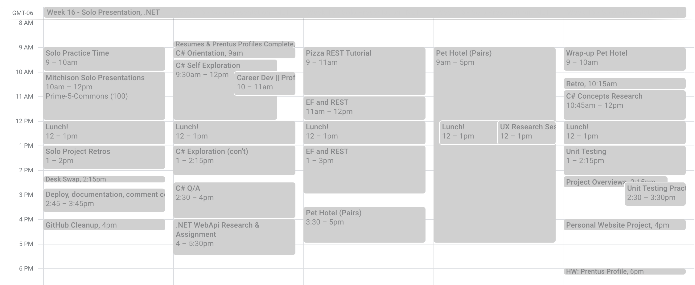

# Week 16 - New Language

## Week Objectives

1. Complete and present Solo Projects!
2. Grow confidence in students' ability to learn new technology
   - Instructor-directed exploration of a new server-side language (.NET / C#)
   - "A guided preview of week 21"
3. Basic exposure to advanced programming patterns 
   - OOP, MVC, ORMs (as part of .NET / C#)
   - Introduction to automated testing
4. [Launch the cohort into Group Projects](./16-00_group-client-project-activities.md)
   - Reintegrate into group work through new technical challenges
   - Meet with clients and assign students to group projects

### Vocabulary / Key Terms

- OOP (Object-oriented programming)
- MVC (Model-View-Controller)
- ORM (Object Relational Mapper)
- Database migration
- Compiled / interpreted
- Static typing

---

## Example Schedule

  
---

## Preparation

As an instructor, C# and .NET may be new technology for you. To prepare for this week:

- Install .NET on your machine, following the instructions in the [Explore .NET / C# Assignment](https://github.com/PrimeAcademy/explore-dotnet). 
  - Try running some of the suggested katas (from codewars.com), to build some familiarity with the language.
- Review the [Explore .NET / C# Concepts](https://github.com/PrimeAcademy/explore-dotnet-concepts) assignment, and make sure you have a basic understanding of each of the concepts.
- Complete the [.NET REST API Tutorial](https://docs.microsoft.com/en-us/learn/modules/build-web-api-aspnet-core/)
- Run through the [Entity Framework Lecture](./16-03-entity-framework.md). Make sure you understand the basics of entity framework, and can get the code running locally.

---

## Regular 5-Day Schedule

## Monday

Solo Project presentations and completion.

- Present solo projects
- Solo project retrospectives
- Give space/time to Deploy solo projects
  - Readmes, code clean up

### Assignment 

- [Github Cleanup](https://github.com/PrimeAcademy/github-finalization-assignment/)
  - due in Week 19

### Solo Project Retros

Provide time and space for students to reflect upon their Solo Projects.

The purpose of reflecting on the Solo Project is primarily about them acknowledging how far they've come, how much they have learned, and that they can overcome challenges with the help of their team. Many students will naturally focus on things that didn't go well, or what they didn't get to.

We need them in a positive headspace to move on this week as they try to tackle a dense new language.

Here are a variety of prompts:

  - https://github.com/PrimeAcademy/Solo-Project-Retro-v2     
  - https://github.com/PrimeAcademy/solo-project-retro

---

## Tuesday - Start C#

The goal for this week is to replace the Node/Express/PG portion of our stack with C#, .NET MVC Core, and Entity Framework.

- [Lecture: New Language](./16-02a_Intro-to-the-week.md)
  - Quick Setup for the week
    - Learning a new language and framework
    - Replacing Node/Express
    - Goal is for students to know they can learn new things
- [Lecture: C# Orientation](./16-02b_Csharp-day1-orientation.md)
  - Goal for the day, guardrails, guidance
- [Assignment: Explore .NET / C#](https://github.com/PrimeAcademy/explore-dotnet)
  - Install .NET and write basic code
  - Students work through C# tutorials, language basics
  - Be able to solve a whiteboard/logic problem like FizzBuzz
  - Code Katas on codewars.com
- [Lecture: C# Q&A](./16-02c-Csharp-review-classes.md)
  - review basic syntax
  - intro and example of a class

## Tuesday Homework & Wednesday Work Time

- [Assignment: Explore REST APIs with .NET and C#](https://github.com/PrimeAcademy/explore-dotnet-rest-api)
    - updated v6.5 to add `no-https` option
  - Continue as homework, if not completed in class
  - [Lecture: Solve](./16-02_dotnet-rest-api.md) after students have worked on it
    - Allow for Q&A, pepper questions at them about the code you write. Try to get students to get to SPEAK

---

## Wednesday - REST/EF

- [Entity Framework Lecture](./16-03_entity-framework.md)
  - Large, dense lecture, will take 2-3 hours
- Group Project [Pet Hotel group project](https://github.com/PrimeAcademy/dotnet-pet-hotel-assignment)

---

## Thursday - GROUP PROJECT

- Complete [Pet Hotel group project](https://github.com/PrimeAcademy/dotnet-pet-hotel-assignment)
- Group project retros

---

## Friday - REVIEW

Now with some context, we can do some exploration and share backs, holding a discussion on this stuff:

- [Assignment: Explore .NET / C# Concepts](https://github.com/PrimeAcademy/explore-dotnet-concepts)
  - Learn and Teachback Discussion
    - Students pick the topic they want to cover
    - Pairs work well, or Solo
  - Have student share their research in class
  - Correct, expand on, and give context to student answers

- Pitch client project to students
  - Sample client project pitches: https://github.com/PrimeAcademy/zhu-client-pitches

- [Project Management](./pm.md) @TODO
  - Goes over Agile practices, terms
  - Usually a guest lecturer/Dev

- [Lecture: Unit Testing with Jest](./16-05a-unit-testing.md)
  - [Assignment: Jest Unit Tests](https://github.com/PrimeAcademy/jest-basic-unit-testing)

---

## Weekend Assignment

- [Job Prep Choose Your Own Adventure](https://github.com/PrimeAcademy/choose-your-own-adventure)
  

## Activities

- [Solo Project Retro](https://github.com/PrimeAcademy/prime-curriculum-syllabus/blob/develop/curriculum-content/classroom-activities/retros.md)

## 1 on 1 Topics

- Solo project retro (what worked, what didn't)
- Job hunting -- are you ready? Have you started? What's your approach?
