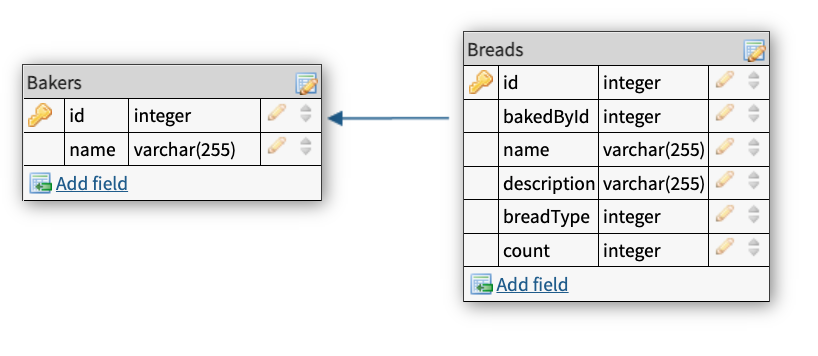

# Entity Framework

Lecture code:

Server side code (.NET API) https://github.com/PrimeAcademy/dotnet-bakery

> Note: there is also a client-side React app that can be used to talk to the .NET API: https://github.com/PrimeAcademy/dotnet-bakery-clientside. For this lecture, it may be easier to focus on the .NET code, and use Postman to test it. 


`Entity Framework`, or `EF`, is an ORM -- an Object-Relational Mapper. This is a way of converting our C# classes and data into Database data and back again. It also helps ensure our data objects match our table schemas.

EF can be either DATABASE-FIRST or MODEL-FIRST. Database first means you make the tables, and then EF makes your Model. MODEL first means you make your model, and EF makes your tables. It's quite cool!

For today's example, we will be using MODEL-FIRST.

EF also allows us to MIGRATE our data and schemas. Migrations allow evolving the database as the model changes. -- It is also VERSION CONTROL for the db! So if we make a code change, we can make it update in the db! And if we mess it up, we can roll it back!


## Setup


**Install Dependencies**

Like npm install, we need to install dependencies:

```
dotnet restore
```

This will install all our dependencies, including the Entity Framework package for us. 

Note that if we were starting from scratch, we'd have to run:

```
dotnet add package Npgsql.EntityFrameworkCore.PostgreSQL
dotnet add package Microsoft.EntityFrameworkCore.Design
```

**Install the Entity Framework command line tool**

This is a one time global install:

```
dotnet tool install --global dotnet-ef
dotnet restore
```

**Create the database**

Create a database called `bakery` using Postico, or the `createdb bakery` terminal command.

 
### Database Connection

Entity Framework needs to know how to connect to our database. This configuration is already setup for us:

```cs
// In appsettings.json
"DefaultConnection": "Host=localhost;Port=5432;Database=bakery;"

// In Startup.cs
string DATABASE_URL = Environment.GetEnvironmentVariable("DATABASE_URL_STR");
string connectionString = (DATABASE_URL == null ? Configuration.GetConnectionString("DefaultConnection") : DATABASE_URL);
Console.WriteLine($"Using connection string: {connectionString}");
```

This is similar to how we setup our `pool.js` file with `node-postgres`.
 
## ERD

We'll be building an app to manage a bakery. This app will have two tables, one for bakers, one for breads. 

This is a one-to-many relationship (a baker has many breads).



Instead of setting up this database with SQL commands in postico, we'll use our Entity Framework create out database tables for us!

## Model setup: Baker

Think about the relationship between Bread and Baker. Bakers make and own bread, so we'll start with a baker.

Make a Baker.cs class.
 
```c#
public class Baker 
{
    // All DB fields need both getter and setter
    // id is special, EF knows it a primary key and serial!
    public int id {get; set;}

    // This is a required database field
    // This makes it NOT NULL in the database,
    // but also automatically sends back 400 errors 
    // if missing in the request body
    [Required]
    public string name {get; set;}
}
```

## Activate BakerModel in DB

`ApplicationContext` is the way we talk to DB!

In `ApplicationContext.cs` we need to activate our class that corresponds to a table:

```cs
public class ApplicationContext : DbContext
{
    public ApplicationContext(DbContextOptions<ApplicationContext> options) : base(options) {}

    // Add this 👇
    // Name of field ("Bakers") is what DB table will be called!
    public DbSet<Baker> Bakers {get; set;} 
}
```


## Database Migrations

A migration is a way of moving your model changes to the DB. 

We can make multiple DB migrations, every time we change one of our models. You can think of each migration like git commit, but tracking changes to the DB, instead of to code. 

Don't delete your migrations! Its a record over time -- like git, you don't want to remove history!
 
Let's make a migration to track our new `Baker` model as a DB table.
First, we'll create a new migration called `CreateBakerTable`

```sh
dotnet ef migrations add CreateBakerTable
```

This generates some C# code in a file called something like `/Migrations/20210920205445_CreateBakerTable.cs`. Take a look a this code -- it's a series of commands to create a database table, matching the `Baker` model that we setup:

```cs
migrationBuilder.CreateTable(
    name: "Bakers",
    columns: table => new
    {
        id = table.Column<int>(type: "integer", nullable: false)
            .Annotation("Npgsql:ValueGenerationStrategy", NpgsqlValueGenerationStrategy.IdentityByDefaultColumn),
        name = table.Column<string>(type: "text", nullable: false)
    },
    constraints: table =>
    {
        table.PrimaryKey("PK_Bakers", x => x.id);
    });
```

This is code that was _generated_ by the `dotnet ef migrations` command. This code might look a little complex, but in essence we're running a `CreateTable` function, which creates a table called `"Bakers"`, with two columns: `id`, and `name`.


Next, we need to actually run this migration code:

```
dotnet ef database update
```

This command will look for all the migration files in `/Migrations` and run them in order. The result is a database all setup and ready for us, that "connect" to our .NET `Model` classes. Check out the database in postico.

A neat thing about the `database update` command: it will remember which migrations have already been run, and only run any _new_ migration. This means we can run this `database update` command as many times as we want, without worrying about getting a `database already exists` error.


## Baker Controller
 
Now that we have a `Baker` model and a `Bakers` database table, let's create a `BakersController` so we can make API requests to a `/api/bakers` endpoint.

Here's the basic template for an API Controller in .NET:

```cs
using System;
using System.Collections.Generic;
using System.Linq;
using Microsoft.AspNetCore.Mvc;
using DotnetBakery.Models;
using Microsoft.EntityFrameworkCore;

namespace DotnetBakery.Controllers
{
    [ApiController]
    [Route("api/[controller]")]
    public class BakersController : ControllerBase
    {
        // _context is an instance of our ApplicationContext class
        // We use _context to query our database
        // Think of it kind of like `pool.query` from node-pg
        private readonly ApplicationContext _context;

        // This is out constructor function
        // Our `ApplicationContext` is automagically passed to it 
        // as an argument by .NET
        public BakersController(ApplicationContext context) 
        {
            _context = context;
        }
    }
}
```

Let's add a `GET /api/bakers` endpoint, to return a list of all bakers in the database:

```cs
// The `[HttpGet]` attribute defines this method as our `GET /api/bakers` endpoint
// This function returns a `IEnumerable<Baker>` object,
// which is .NET's fancy way of saying "A list of baker objects"
[HttpGet]
public IEnumerable<Baker> GetAll() 
{
    // Look ma, no SQL queries!
    return _context.Bakers;
}
```

Let's try it out! If you haven't already, get your server up and running:

```
dotnet watch run
```

Then make the API request in Postmane: `GET /api/bakers`

We should see an empty array, as there are no bakers yet in the `Baker` table. We can manually add some records to that table, and they should show up in the `GET /api/bakers` endpoint.
    
So what is this magic with `_context.Bakers`? Remember that `_context` is an instance of our `ApplicationContext` class. If we look at this class, we can see that _context.Bakers is a property with the type `DbSet<Baker>`:

```cs
public class ApplicationContext : DbContext
{
    // 👇 This is _context.Bakers 
    // DbSet<Baker> means: data from the database, that is mapped to the Baker model.
    public DbSet<Baker> Bakers { get; set; }
}
```

These `DbSet` properties are "mapped" to database tables. This means we can just return `_context.Bakers` and .NET will make a SQL query for us and find all the records from the `Bakers` table.

---

These `DbSet` object have some other tricks up their sleaves. For example, we can find a DB record by ID:

```cs
// GET /api/bakers/:id
[HttpGet("{id}")]
public ActionResult<Baker> GetById(int id) {
    Baker baker =  _context.Bakers
        .SingleOrDefault(baker => baker.id == id);
    
    // Return a `404 Not Found` if the baker doesn't exist
    if(baker is null) {
        return NotFound();
    }

    return baker;
}
```
 
Or we can use `_context` to `INSERT` a record:

```cs
// POST /api/bakers
// Note that .NET parses our JSON request body for us
// and converts it to a `Baker` model object.
[HttpPost]
public Baker Post(Baker baker) 
{
    _context.Add(baker);
    _context.SaveChanges();

    return baker;
}
```

## Bread Model

 What do we need for a `bread` object? 
 - primary key
 - name
 - description
 - bread type -- which?
 - count -- how many?
 - bakerId who made it
 
 
 ### Bread Model Class
 
 ```c#
using System.Collections.Generic;
using System;
using System.Text.Json.Serialization;
using System.ComponentModel.DataAnnotations;
using System.ComponentModel.DataAnnotations.Schema;

namespace DotnetBakery
{
    public class Bread 
    {

        public int id {get; set;}

        public string name {get; set;}

        public string description {get; set;}

        public int count {get; set;}

        // This is the Id of the baker who made this bread
        // In a moment, we'll see how .NET can use this field to 
        // join our tables together for us
        [ForeignKey("bakedBy")]
        public int bakedById { get; set; }

        // While bakedById is an integer with the baker's ID,
        // this field is an actual Baker object. 
        // This will allow us to nest the baker object
        // inside our bread response from `GET /breads`
        public Baker bakedBy { get; set; }
   }
}
``` 


 
 ### Enum Types

 For the bread `type`, we could use a string, but instead we'll use a special `Enum` type for our types:

 
 Add this inside the `DotnetBakery` namespace

 ```c#
public enum BreadType 
{
    Sourdough, //0
    Focaccia, //1
    Rye, 
    White
}
 ```
 

 You can think of an Enum as a string that may only have a few possible values. So in this case, a `Bread` object may only have a type of `"Sourdough"`, `"Focaccia"`, `"Rye"`, or `"White"`. If we try to `POST` any other bread type to the API, it will automatically return a 400 error.

Then add this as a property of our `Bread` model:


```cs
// We need this `JsonConverter` attribute
// to convert our `type` string into an Enum
[JsonConverter(typeof(JsonStringEnumConverter))]
public BreadType type {get; set;}
```


  
### Activate Bread in DB

Next, we need to tell .NET that the `Bread` model should be "mapped" to a database table.

 ```cs
 // In /Models/ApplicationContext.cs
 public DbSet<Bread> Breads {get; set;}
 ```
 
### Bread Table Migration

Generate the migration files

```
dotnet ef migrations add CreateBreadTable
```

Run the migration

```
dotnet ef database update
```

## Bread Controller

```c#
[ApiController]
[Route("api/[controller]")]
public class BreadsController : ControllerBase
{
    private readonly ApplicationContext _context;
    public BreadsController(ApplicationContext context) 
    {
        _context = context;
    }


    // GET /api/breads
    // Returns all breads
    // Note that `IEnumerable<Bread>` is C#'s fancy way 
    // of saying "a list of Baker objects"
    [HttpGet]
    public IEnumerable<Bread> GetBreads() 
    {
        return _context.Breads
            // Include the `bakedBy` property
            // which is a list of `Baker` objects
            // .NET will do a JOIN for us!
            .Include(bread => bread.bakedBy);
    }

    // GET /api/breads/:id
    // Returns the bread with the given id
    [HttpGet("{id}")]
    public ActionResult<Bread> GetById(int id) {
        Baker bread =  _context.Breads
            .SingleOrDefault(bread => bread.id == id);
        
        if(bread is null) {
            return NotFound();
        }

        return bread;
    }

    // POST /api/breads
    // .NET automatically converts our JSON request body
    // into a `Bread` object. 
    [HttpPost]
    public Bread Post(Bread bread) 
    {
        // Tell the DB context about our new bread object
        _context.Add(bread);
        // ...and save the bread object to the database
        _context.SaveChanges();

        // Respond back with the created bread object
        return bread;
    }

    // PUT /api/breads/:id
    // Updates a bread by id
    [HttpPut("{id}")]
    public Bread Put(int id, Bread bread) 
    {
        // Our DB context needs to know the id of the bread to update
        bread.id = id;

        // Tell the DB context about our updated bread object
        _context.Update(bread);

        // ...and save the bread object to the database
        _context.SaveChanges();

        // Respond back with the created bread object
        return bread;
    }

    // DELETE /api/breads/:id
    [HttpDelete("{id}")]
    public void Delete(int id) 
    {
        // Find the bread, by ID
        Bread bread = _context.Breads.Find(id);

        // Tell the DB that we want to remove this bread
        _context.Breads.Remove(bread);

        // ...and save the changes to the database
        _context.SaveChanges();;
    }
}
```
  
  